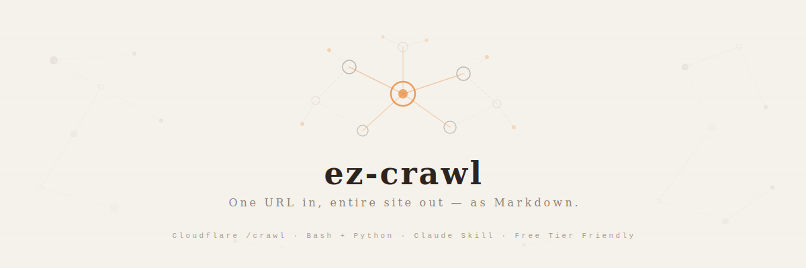

<p align="center">
  
</p>

<h1 align="center">ez-crawl</h1>

<p align="center">
  <strong>Give it a URL. Get the entire site back as Markdown.</strong><br/>
  A Claude Code / Cowork skill &amp; standalone CLI that crawls websites using Cloudflare's headless browser — static sites, SPAs, JS-rendered pages, all of it.
</p>

<p align="center">
  <a href="#-quick-start"></a>
  <a href="LICENSE"></a>
  <a href="https://developers.cloudflare.com/browser-rendering/"></a>
</p>

<br/>

---

## Why This Exists

You want to feed an entire documentation site into an LLM, build a local knowledge base, or just archive a website as clean Markdown. The usual approach? Write a custom scraper, fight with pagination, handle JavaScript rendering, deal with rate limits. For every. single. site.

**ez-crawl** wraps Cloudflare's [`/crawl` REST API](https://developers.cloudflare.com/browser-rendering/rest-api/crawl-endpoint/) into a single command. Point it at a URL — it discovers subpages via sitemap and link-following, optionally renders JavaScript, and hands you back Markdown, HTML, or structured JSON. The whole thing runs on Cloudflare's infrastructure, so you don't need to spin up Puppeteer or manage headless browsers yourself.

It works as a Claude skill (say "crawl this site") or as a plain bash script. Either way, one URL in, entire site out.

---

## ✦ Features

**One-Command Crawl** — Give a URL, get the full site. Cloudflare handles subpage discovery via sitemaps and link traversal. No configuration files, no dependency hell — just `crawl.sh <url>`.

**Smart Rendering** — Static HTML site? `render: false` keeps it fast and free. React/Next.js SPA? `render: true` fires up a headless browser. The Claude skill auto-detects which mode to use.

**Multiple Output Formats** — Markdown (default, perfect for LLMs), raw HTML, or JSON with AI-powered structured extraction via Workers AI. Extract product names, prices, descriptions — whatever schema you define.

**Free Tier Friendly** — Built-in strategies to maximize Cloudflare's free plan: resource blocking, URL pattern filtering, caching with `maxAge`, and smart render toggling. The README tells you exactly how to stretch those 10 free minutes.

---

## ✦ Quick Start

### Prerequisites

- [Cloudflare account](https://dash.cloudflare.com) (free)
- API Token with **Browser Rendering → Edit** permission
- `curl`, `jq`, Python 3.6+

### Setup

1. **Clone the repo**

```bash
git clone https://github.com/0xedgelessblade/ez-crawl.git
cd ez-crawl
```

2. **Add your credentials**

```bash
cp .env.example .env
# Edit .env — fill in CF_ACCOUNT_ID and CF_API_TOKEN
```

> **Where to get these?**
> **Account ID** — [Dashboard](https://dash.cloudflare.com) homepage → right sidebar.
> **API Token** — [Create Token](https://dash.cloudflare.com/profile/api-tokens) → Custom Token → Permission: *Account → Browser Rendering → Edit*.

3. **Verify everything works**

```bash
./scripts/verify.sh
```

4. **Crawl something**

```bash
./scripts/crawl.sh https://docs.example.com --limit 50

# Split results into individual Markdown files
python scripts/split-results.py results/crawl-*.json --output-dir pages/
```

---

## ✦ How It Works

```
                    ┌──────────────────┐
  You give a URL    │   crawl.sh       │    Markdown files
  ───────────────▶  │                  │  ──────────────────▶
                    │  1. POST /crawl  │    pages/
                    │  2. Poll status  │    ├── getting-started.md
                    │  3. Fetch result │    ├── api-reference.md
                    │  4. Split pages  │    └── ...
                    └──────────────────┘
                           │
                    Cloudflare Browser
                    Rendering handles
                    the actual crawling
```

The process runs in three stages:

1. **Submit** — `crawl.sh` sends a POST to Cloudflare's `/crawl` endpoint with your URL, page limit, and render settings.
2. **Poll** — The script checks job status every few seconds until Cloudflare finishes discovering and fetching all subpages.
3. **Collect** — Results come back as a single JSON blob. `split-results.py` breaks it into individual Markdown files with YAML frontmatter (title, URL, status).

---

## ✦ Use as a Claude Skill

Install into Claude Code or Cowork, then trigger with natural language:

```
幫我把 https://docs.astro.build 爬下來轉成 markdown
crawl this site and save as markdown
use Cloudflare crawl to grab the react.dev API docs
```

**Claude Code:**
```bash
cp -r ez-crawl/ ~/.claude/skills/
```

**Cowork:**
Copy the folder to your workspace's `.skills/skills/` directory.

> **Trigger phrases:** `/ez`, `ez crawl`, or just describe what you want to crawl.

---

## ✦ CLI Reference

```bash
./scripts/crawl.sh <url> [options]
```

| Option | Default | Description |
|--------|---------|-------------|
| `--limit N` | `10` | Max pages to crawl (free tier cap: 100) |
| `--render BOOL` | `false` | Enable JS rendering — set `true` for SPAs |
| `--formats JSON` | `["markdown"]` | Output format: `markdown`, `html`, `json` |
| `--include PATTERN` | — | Only crawl URLs matching this glob |
| `--exclude PATTERN` | — | Skip URLs matching this glob |
| `--output DIR` | `results/` | Where to save the raw JSON result |
| `--poll N` | `5` | Polling interval in seconds |

---

## ✦ Examples

**Static docs site** — no JS needed, saves browser time:
```bash
./scripts/crawl.sh https://docs.astro.build/en/getting-started/ \
  --limit 30 --render false --include "**/getting-started/**"
```

**SPA with URL filtering** — React/Next.js, needs JS rendering:
```bash
./scripts/crawl.sh https://react.dev \
  --limit 100 --render true --include "https://react.dev/reference/react/**"
```

**AI structured extraction** — extract product data as JSON:
```bash
source .env
curl -X POST \
  "https://api.cloudflare.com/client/v4/accounts/${CF_ACCOUNT_ID}/browser-rendering/crawl" \
  -H "Authorization: Bearer ${CF_API_TOKEN}" \
  -H "Content-Type: application/json" \
  -d @examples/ai-extraction.json
```

See [`examples/`](examples/) for more payload templates.

---

## ✦ Free Tier Limits

| | Workers Free | Workers Paid ($5/mo) |
|---|---|---|
| Browser time | 10 min/day | Pay-as-you-go |
| Crawl jobs | 5/day | Unlimited |
| Pages per job | 100 | 100,000 |
| API requests | 6/min | 600/min |

**Stretch your free quota:** use `render: false` for static sites (zero browser time during beta), add `rejectResourceTypes: ["image", "media", "font", "stylesheet"]` to block heavy assets, use `includePatterns` to narrow scope, and set `maxAge` to leverage caching.

---

## ✦ Troubleshooting

| Problem | Solution |
|---------|----------|
| Empty results / all skipped | Check target site's `robots.txt` — must allow `CloudflareBrowserRenderingCrawler` |
| `cancelled_due_to_limits` | Free quota exhausted — wait until tomorrow or upgrade |
| Slow crawling | Use `render: false`, add `rejectResourceTypes`, reduce `--limit` |
| Blocked by bot protection | `/crawl` cannot bypass WAF/Turnstile — only works on sites you control |
| `verify.sh` says token invalid | Confirm token has *Account → Browser Rendering → Edit* permission |

---

## ✦ Project Structure

```
ez-crawl/
├── README.md                  # You are here
├── SKILL.md                   # Claude skill instructions
├── LICENSE                    # MIT
├── CHANGELOG.md               # Version history
├── .env.example               # Credential template (never commit .env!)
├── .gitignore                 # OS + editor + language ignores
├── assets/
│   └── banner.svg             # README header banner
├── scripts/
│   ├── crawl.sh               # Main crawl script — the star of the show
│   ├── split-results.py       # Split JSON results into individual Markdown files
│   └── verify.sh              # Verify Cloudflare credentials
└── examples/
    ├── static-docs.json       # Static site crawl payload
    ├── spa-filtered.json      # SPA + URL filtering payload
    └── ai-extraction.json     # AI structured extraction payload
```

---

## ✦ License

[MIT](LICENSE) — do whatever you want with it.

---

## ✦ References

- [/crawl endpoint docs](https://developers.cloudflare.com/browser-rendering/rest-api/crawl-endpoint/)
- [Browser Rendering limits](https://developers.cloudflare.com/browser-rendering/limits/)
- [Browser Rendering pricing](https://developers.cloudflare.com/browser-rendering/platform/pricing/)

---

<p align="center">
  <sub>Powered by <a href="https://developers.cloudflare.com/browser-rendering/">Cloudflare Browser Rendering</a>.</sub><br/>
  <sub>If this saved you from writing yet another scraper — consider giving it a ⭐</sub>
</p>
